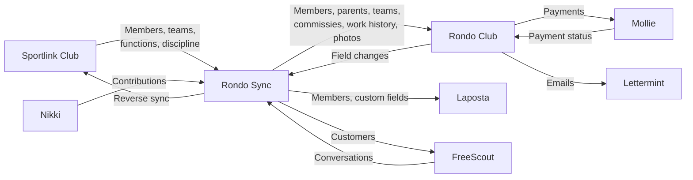

Rondo is a platform for managing sports club members, teams, and operations. It consists of two main components plus several integrations.

## Rondo Club

A WordPress theme (PHP + React/Vite) that provides a web application for managing people, teams, and club operations. It exposes a REST API for both its own frontend and external consumers.

**Tech stack:** WordPress 6.0+, PHP 8.0+, ACF Pro, React 18, Vite 5, Tailwind CSS, TanStack Query.

## Rondo Sync

A Node.js CLI tool that syncs member data between Sportlink Club, Nikki, and the downstream systems. It uses browser automation (Playwright) because neither Sportlink nor Nikki provide APIs.

**Tech stack:** Node.js 18+, Playwright (Chromium), better-sqlite3, Lettermint.

## Data Flow

| System | Role |
|--------|------|
| **Sportlink Club** | Source of truth for member data (KNVB-mandated). No API — scraped via browser automation. |
| **Nikki** | Financial system for contribution data. Scraped via browser automation. |
| **Rondo Club** | Central club management app. REST API consumer and provider. |
| **Rondo Sync** | Orchestrator that keeps all systems in sync via scheduled pipelines. |
| **Laposta** | Email marketing — receives member data for mailing lists. |
| **FreeScout** | Helpdesk — receives member data as customers, sends conversations back. |
| **Mollie** | Payment provider — handles membership fee payments and invoicing. |
| **Lettermint** | Transactional email delivery from Rondo Club. |

## Next Steps

- **[Architecture](/architecture/)** — High-level Rondo Club system design
- **[Data Model](/data-model/)** — Custom post types, taxonomies, and fields
- **[REST API](/api/rest-api/)** — Rondo Club API reference
- **[Sync Architecture](/sync/architecture/)** — How Rondo Sync works
