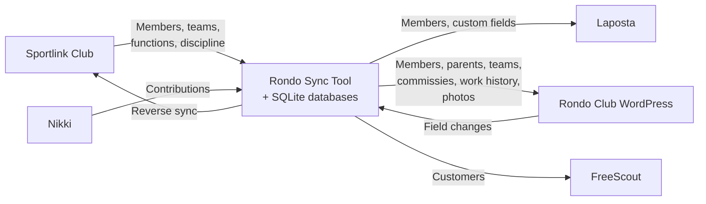

Sportlink Club is the member administration system used by Dutch sports clubs, mandated by the KNVB (Royal Dutch Football Association). It is the single source of truth for member data, but it lacks APIs and has a limited, dated web interface. This tool extracts member data from Sportlink and syncs it to the systems where it's actually needed: Laposta for email marketing, Rondo Club (a WordPress site) for club management, and FreeScout for helpdesk support. It also pulls contribution data from Nikki, a separate financial system. The goal is to keep all downstream systems in sync with Sportlink automatically, so club volunteers never have to enter the same data twice.

## System Overview



### Why Browser Automation?

Neither Sportlink Club nor Nikki provide APIs. All data is extracted by automating their web applications using **Playwright (headless Chromium)**. The sync tool logs in, navigates pages, and intercepts the internal requests (like `SearchMembers`, `MemberHeader`, `MemberFreeFields`, `UnionTeams`) that the web app makes to its own backend. Nikki is different — it has no internal requests to intercept, so contribution data is scraped from HTML tables and CSV exports. The reverse sync also uses browser automation to fill in Sportlink's web forms.

## Schedules

All times are **Europe/Amsterdam** timezone.

| Pipeline | Schedule | Cron | Notes |
|----------|----------|------|-------|
| People | 4x daily | `0 8,11,14,17 * * *` | Members, parents, photos |
| Nikki | Daily | `0 7 * * *` | Contributions to Rondo Club |
| Functions (recent) | 4x daily | `30 7,10,13,16 * * *` | 30 min before each people sync; members updated in last 2 days + VOG-filtered volunteers |
| Functions (full) | Weekly Sunday | `0 1 * * 0` | All members with `--all` |
| FreeScout | Daily | `0 8 * * *` | Rondo Club members to FreeScout customers |
| Teams | Weekly Sunday | `0 6 * * 0` | Team creation + work history |
| Discipline | Weekly Monday | `30 23 * * 1` | Discipline cases |
| Reverse Sync | Hourly | `0 * * * *` | Rondo Club changes back to Sportlink (**currently disabled**) |

### Daily Timeline

```
 Every hour    Reverse sync (Rondo Club -> Sportlink) [currently disabled]
 07:00         Nikki sync
 07:30         Functions sync (recent) -> 08:00 People sync (1st) + FreeScout sync
 10:30         Functions sync (recent) -> 11:00 People sync (2nd)
 13:30         Functions sync (recent) -> 14:00 People sync (3rd)
 16:30         Functions sync (recent) -> 17:00 People sync (4th)
```

### Weekly

```
 Sunday  01:00  Functions sync (full --all)
 Sunday  06:00  Teams sync
 Monday  23:30  Discipline sync
```

## API Load Management

Every pipeline is designed to keep data as fresh as possible while minimizing API calls and avoiding overload on external services.

### Selective Sync via Hash-Based Change Detection

All pipelines use **hash-based change detection**. Each record gets a SHA-256 hash of its data (`source_hash`). On sync, the hash is compared to `last_synced_hash`. API calls only happen when hashes differ. This means:

- Local work (reading SQLite, computing hashes) runs every time -- this is cheap
- Expensive work (API calls to Laposta/Rondo Club/FreeScout) only runs for actual changes
- On a typical run with no changes, zero API calls are made

The Functions pipeline takes this further: the daily run only scrapes data for members updated in Sportlink within the last 2 days (plus VOG-filtered volunteers), avoiding the need to scrape all ~1000+ members every day.

### Rate Limiting and Delays

When API calls are needed, all pipelines insert delays between requests to avoid overwhelming external services:

| Target | Delay | Notes |
|--------|-------|-------|
| Laposta API | 2s between requests | Fixed delay via `waitForRateLimit()` |
| Rondo Club WordPress API | Exponential backoff on errors | 1s, 2s, 4s on retries |
| Rondo Club photo uploads | 2s between uploads | Both upload and delete operations |
| Nikki to Rondo Club | 500ms between updates | |
| Photo downloads (Sportlink) | 500ms-1.5s between members | Playwright-based, random jitter |
| FreeScout API | Exponential backoff on errors | 1s, 2s, 4s on 5xx errors |
| Sportlink browser scraping | 500ms-1.5s between members | Random jitter to avoid patterns |
| Reverse sync (Sportlink) | 1-2s between members | Random jitter, exponential backoff on errors |

---

## Pipelines

Each pipeline has its own detailed documentation page covering step-by-step flow, field mappings, CLI flags, error handling, and source files.

| Pipeline | What it does | Details |
|----------|-------------|---------|
| [People](/sync/pipeline-people/) | Downloads members from Sportlink, syncs to Laposta + Rondo Club, handles photos | 7-step flow: download, prepare Laposta, submit Laposta, submit Rondo Club (members + parents + birthdate), download photos, upload photos, reverse sync |
| [Nikki](/sync/pipeline-nikki/) | Downloads contribution data from Nikki, writes per-year financial fields to Rondo Club | Playwright scraping of HTML tables + CSV; aggregates multiple contribution lines per member per year |
| [Teams](/sync/pipeline-teams/) | Downloads team rosters from Sportlink, creates team posts, links members via work history | 3-step flow: download teams, sync teams to Rondo Club, sync work history to person posts |
| [Functions](/sync/pipeline-functions/) | Scrapes committee memberships and free fields from Sportlink | Runs in daily (recent) and weekly (full) modes; also scrapes FreeScout ID, VOG date, and financial block used by the People pipeline |
| [FreeScout](/sync/pipeline-freescout/) | Syncs Rondo Club member data to FreeScout as customers | Enriches helpdesk customers with team memberships, KNVB ID, and Nikki contribution data |
| [Discipline](/sync/pipeline-discipline/) | Downloads discipline cases from Sportlink, syncs to Rondo Club | Cases linked to person posts via `knvb_id`; categorized by season taxonomy |
| [Reverse Sync](/sync/reverse-sync/) | Detects field changes in Rondo Club, pushes back to Sportlink | **Currently disabled.** Two-phase: change detection + browser automation sync with conflict resolution |

---

## Databases

Four SQLite databases on the server at `/home/rondo/data/` track sync state. See [Database Schema](/sync/database-schema/) for full table definitions.

| Database | Purpose | Key Tables |
|---|---|---|
| `laposta-sync.sqlite` | Laposta sync + Sportlink run data | `members`, `laposta_fields`, `sportlink_runs` |
| `rondo-sync.sqlite` | Rondo Club ID mappings + all Sportlink scraped data | `stadion_members`, `stadion_parents`, `stadion_teams`, `stadion_commissies`, `stadion_work_history`, `stadion_commissie_work_history`, `sportlink_member_functions`, `sportlink_member_committees`, `sportlink_member_free_fields`, `sportlink_team_members` |
| `nikki-sync.sqlite` | Nikki contribution data | `nikki_contributions` |
| `freescout-sync.sqlite` | FreeScout customer mappings | `freescout_customers` |

The `stadion_id` mapping (knvb_id -> WordPress post ID) is critical: without it, syncs create duplicate entries instead of updating existing ones. All databases live on the production server only.

---

## Locking

Each sync type uses `flock` via `scripts/sync.sh` to prevent overlapping runs of the same type. Different sync types can run in parallel. Lock files: `.sync-{type}.lock` in the project directory.
